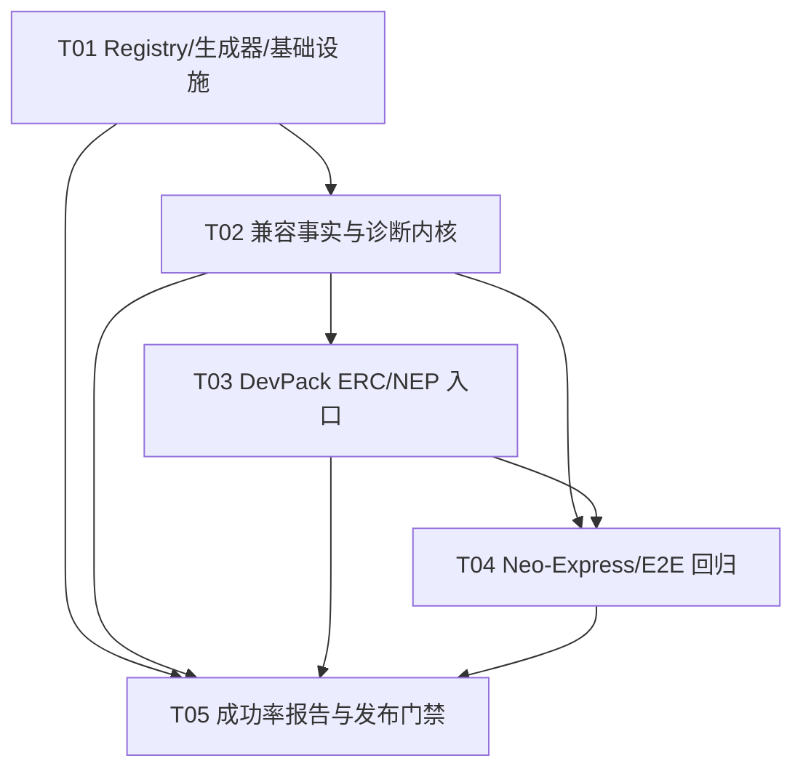

# Solidity 尽量无感编译到 Neo N3：增量兼容架构与实施计划

> 基线：`D:\Git\neo-devpack-solidity`  
> 文档性质：只读勘测后的增量架构设计；本轮不修改源码、不运行 cargo。  
> 目标：最大化普通 Ethereum Solidity 合约迁移到 Neo N3 的成功率，同时对不能等价迁移的 Neo 语义给出可定位、可操作的诊断。

## 1. 基线勘测与结论

### 1.1 当前已经可复用的入口

| 领域 | 已确认入口 | 当前行为/限制 |
|---|---|---|
| ABI 编译入口 | `compile_contracts(...)`、Standard JSON（`src/cli/standard_json.rs` 及 `standard_json_process/`）、`neo-solc` CLI | 继续保持现有退出码、NEF/manifest 产物和标准 JSON 形状，不新增平行编译器入口。 |
| 统一诊断模型 | `src/diagnostics/diagnostic.rs` 的 `Diagnostic`, `SourceSpan`, `Suggestion`；`src/diagnostics/report.rs` 的 `Report::{render,to_json}`；`src/diagnostics/error_code.rs` 的 `ErrorCode` | 已有稳定 `NSH-XXXX` 错误码，但 legacy Solidity/IR 诊断仍映射到泛化 `NSH-2000/3000`，应增加兼容专题码和建议元数据。 |
| `msg.*` | `src/ir/ir_expressions/member_access/runtime_values.rs::try_lower_runtime_member_access` | `msg.sender` 走 `Runtime.GetCallingScriptHash`；NEP-17/11 callback 中 `msg.sender/value/data` 分别映射参数；callback 外 `msg.value` 不能表示 Neo 附带值。 |
| 低级调用 | `src/ir/ir_expressions/calls/low_level.rs::try_lower_low_level_address_call`；`low_level_support.rs::{parse_low_level_call_data,resolve_call_data_local,emit_low_level_success_tuple_from_stack}` | `call/staticcall` 已解析 `abi.encodeWithSignature/Selector/Call`，使用 `System.Contract.Call`/`ContractCallWithFlags` 和 TRY/ENDTRY；`delegatecall/callcode` 当前运行时陷阱（编译 warning），不能伪装成普通 CALL。 |
| ABI | `src/ir/ir_expressions/calls/builtins/abi_encode.rs`、`abi_decode.rs` 及 `abi_encode_{static,dynamic,packed}.rs`、`abi_decode_{slot,dynamic,static}.rs` | 已实现 EVM canonical head/tail、静态/动态类型和 decode 长度保护；仍需将“低级 call payload”与“通用 ABI bytes”场景分层验收。 |
| value transfer | `src/ir/ir_expressions/calls/value_transfer.rs::try_lower_value_transfer_helpers` | `address.transfer/send` 映射 GAS `transfer(from,to,amount,data)`；`transfer` 失败抛错，`send` 返回 bool；只有地址目标走该分支，接口/合约句柄走外部调用。 |
| 标准检测 | `src/manifest/standards.rs::detect_supported_standards`、`validate_transfer_event`、`event_native_transfer_standard` | 严格检查 NEP-17/11 方法、Transfer 事件和参数数量；已有 ERC 近似合约诊断。当前 ERC-20 的 2 参数 `transfer` 不应直接宣称 NEP-17。 |
| DevPack 兼容层 | `devpack/contracts/compat/EVMNativeAssetAdapter.sol`、`EVMFallbackDispatcher.sol`、`EVMContractFactory.sol` | 已有 `onNEP17Payment`→`_onEVMValue`、显式 selector dispatch、ContractManagement deploy/update/destroy 包装，是本轮兼容 API 的首选扩展点。 |
| DevPack 标准实现 | `devpack/standards/NEP17.sol`、`NEP11.sol`、`NEP24.sol`、`NEP26.sol`、`NEP27.sol` | 已有 NEP 标准接口及 ERC allowance 兼容路径；需明确“适配入口”和“声明 supportedstandards”是两个独立结果。 |
| E2E 入口 | `examples/test_neoxp_evm_compat_smoke.sh`、`test_neoxp_lowlevel_call_smoke.sh`、`test_neoxp_abidecode_smoke.sh`、`test_neoxp_wgas_smoke.sh`、`test_compilation.sh`、`test_neoxp_famous_contracts*` | 已具备 Neo-Express 进程、deploy、invoke、application-log 检查套路；可增量扩展，不另造测试 harness。 |
| EVM 迁移样本 | `examples/ERC20Token.sol`、`ERC721Token.sol`、`UniswapV2Pair.sol`、`examples/famous/`、`third_party/famous-contracts/samples/` | 普通 ERC/Uniswap/OZ 形态已经覆盖编译样本；proxy/ delegatecall 样本必须分类为“可编译但不可执行”或“明确拒绝路径”。 |

### 1.2 已发现的文档漂移

- `docs/SOLIDITY_SUPPORT_MATRIX.md` 顶部写 v0.27.0、审计日期 2026-07-02，正文汇总为 **117/31/2/1，总计 151**。
- `FEATURE_MATRIX.md` 汇总为 **114/29/2/1，总计 146**，审计日期 2026-07-03；虽声明是 redirect，数字已经漂移。
- `README.md` 同时引用“canonical matrix”和若干手写能力结论，容易继续漂移。
- 设计结论：矩阵必须由单一机器可读 registry 生成；README、FEATURE_MATRIX、VitePress 页面和矩阵正文只允许引用生成片段/链接，禁止手写计数。

## 2. 总体架构

### 2.1 分层

```text
Solidity source
  -> frontend/parser + source feature scanner
  -> semantic analysis (ERC/NEP shape + EVM hazard facts)
  -> IR lowering (Neo-compatible lowering or explicit trap)
  -> optimizer/codegen
  -> manifest/ABI/standard detector
  -> diagnostics + migration report
  -> neo-solc / Standard JSON / tooling

DevPack Solidity adapters
  -> EVMNativeAssetAdapter (NEP-17 payment context)
  -> EVMFallbackDispatcher (explicit selector routing)
  -> EVMContractFactory (Neo deploy/update/destroy)
  -> NEP17/NEP11/NEP24 wrappers and ERC-shaped facade methods

Acceptance oracle
  -> embedded Rust runtime (fast regression)
  -> Neo-Express (authoritative VM/manifest/NEP behavior)
```

不引入第二套运行时或 EVM interpreter。兼容层优先做：

1. **源代码可继续编译**；
2. **需要 Neo 语义时自动改写到正确 Neo 原语**；
3. **无法等价时，生成稳定诊断 + 替代建议 + 可审计风险标记**；
4. **禁止把危险操作静默降级为看似成功的空操作**。

### 2.2 单一支持矩阵生成

新增机器可读 registry（推荐 `docs/data/solidity_support_matrix.json`，若项目更偏源码维护也可放 `scripts/data/`，但只有一个 canonical 文件）：

```json
{
  "schemaVersion": 1,
  "compilerRange": "0.5.x-0.8.x",
  "target": "NeoVM Neo N3",
  "features": [
    {
      "id": "evm.address.delegatecall",
      "category": "EVM-specific",
      "syntax": "address.delegatecall(bytes)",
      "status": "blocked",
      "diagnosticCode": "NCOMP-4001",
      "alternative": "ContractManagement.update(), inheritance, or explicit contractCall",
      "sourceRefs": ["src/ir/ir_expressions/calls/low_level.rs"]
    }
  ]
}
```

生成器（推荐 `scripts/generate_solidity_support_matrix.py`）必须：

- 校验每条 feature 的 `id` 唯一、status/diagnosticCode/alternative 完整；
- 从 registry 计算各分类和总计；
- 生成 `docs/SOLIDITY_SUPPORT_MATRIX.md`（正文、表格、汇总、生成版本/日期）；
- 生成 `FEATURE_MATRIX.md` 的 redirect + 机器生成 summary；
- 生成 README 的可嵌入片段（例如 `docs/generated/solidity-support-summary.md`）或让 README 仅显示链接；
- 在 CI 中执行 `--check`，确保工作区生成物无 diff；
- 提供 `--explain <feature-id>` 输出实现文件、测试、语义等级和替代建议。

状态建议固定为：`supported`、`approximate`、`manual_migration`、`unsupported`、`blocked`。矩阵数字只能由 generator 输出，绝不在 README/FEATURE_MATRIX 中重复维护。

## 3. 兼容语义设计

### 3.1 `receive` / `payable` / `msg.value`

#### 编译策略

- `receive() external payable`：保留 Solidity body，但生成 manifest 时仅在没有显式 `onNEP17Payment` 时提供**兼容别名/重映射**；若已有显式 callback，不再伪造两个同名入口，输出 warning。
- `fallback()`：不模拟 EVM unknown-selector 自动路由；保留显式入口，并建议继承 `EVMFallbackDispatcher`，通过 `dispatch(bytes4,bytes)` 主动路由。
- `payable`：作为源兼容修饰符保留，但不能表示 Neo 调用附带 GAS。非 callback 中使用 `msg.value` 必须输出 `NCOMP-1002` warning（默认值为 0 或 host override 只限测试，不作为链上语义）。
- `onNEP17Payment(address from,uint256 amount,Any/bytes data)`：作为实际入金入口；callback 内 `msg.sender` 表示 token 合约（`Runtime.GetCallingScriptHash`），`msg.value` 表示 amount，`msg.data` 表示 callback data。
- 同时支持 `onNEP11Payment` 时，禁止把 NFT amount/tokenId 混淆到 NEP-17 adapter；分别输出 payment context。

#### DevPack API 扩展方向

保持 `EVMNativeAssetAdapter.onNEP17Payment` 与 `_onEVMValue(token,from,amount,data)` 现有签名；增量可增加：

```solidity
struct PaymentContext {
    address token;
    address sender;
    uint256 amount;
    bytes data;
}
function _evmValueContext() internal view returns (PaymentContext memory);
function _onEVMValue(address token, address from, uint256 amount, bytes memory data) internal virtual;
```

如果增加状态快照，必须说明其“last payment”而非交易级 `msg.value`，避免用户误以为可重入安全或跨调用稳定。

### 3.2 `address.call` / `staticcall` 与 ABI

#### 已有实现应保留

- `address.call(payload)` → `System.Contract.Call`，包装为 `(bool success, bytes returndata)`，callee fault 在 TRY/ENDTRY 中变成 `success=false`；local evaluation fault 仍 abort。
- `address.staticcall(payload)` → `ContractCallWithFlags`，使用 ReadOnly（当前代码为 `0x05`）调用标志；不应宣称与 EVM `STATICCALL` 完全等价，Neo permission/call flags 是不同机制。
- `abi.encodeWithSignature/Selector/Call`：已能在静态可解析时提取 method name/arguments；运行时 opaque payload 若无法解析，应保持 fail-loud 诊断，而非 fake success。
- `abi.encode`/`abi.decode`：通用数据采用 EVM canonical 32-byte head/tail；Neo-native `StdLib.serialize/deserialize` 仅作为显式 Neo 序列化，不得混用。

#### 兼容层契约

新增统一内部概念 `EvmCallPlan`（Rust `pub(crate)`）：

```text
EvmCallPlan {
  target: Expression,
  method: Option<String>,
  arguments: Vec<Expression>,
  mode: CallMode,             // Call | ReadOnly
  payloadKind: PayloadKind,   // CanonicalAbi | NeoSerialized | Opaque
  returnTypes: Vec<ValueType>,
  diagnostics: Vec<CompatibilityFinding>
}
```

`try_lower_low_level_address_call` 只负责把 AST 解析成 `EvmCallPlan` 并调用 emitter；ABI encode/decode 负责 payloadKind 和 return bytes；manifest permissions 扫描必须读取同一个 plan，避免编译行为与权限声明漂移。

#### 不能等价的情况

- EVM callee 的 fallback/unknown selector dispatch 不会自动发生；必须显式 `dispatch`。
- `staticcall` 只能尽量映射 ReadOnly flags；callee 依赖 EVM `STATICCALL` 的深层约束时标记 approximate。
- `msg.data` 在内部跨合约调用不等于 EVM 每层新 calldata；建议显式传 `bytes data`。
- 返回 bytes 若是 Neo StackItem 数组而非 canonical ABI，调用方必须使用 typed interface 或 encode/decode 适配器。

### 3.3 `transfer` / `send`

- `payable(address).transfer(amount)` / `address.transfer(amount)`：映射 GAS NEP-17 native contract `transfer(executingScriptHash,to,amount,"" )`；失败抛错；不能表达任意 ERC-20 token。
- `.send(amount)`：同样调用 GAS transfer，返回 bool；“不抛错”只针对 transfer 结果，不掩盖本地表达式或权限 fault。
- `IERC20(token).transfer(...)` / `IERC721(...).transferFrom(...)`：必须走 typed cross-contract call，不能被 `value_transfer.rs` 误识别成 GAS value send。
- 带 `{value: amount}` 的 EVM call options：不应隐式塞入 `System.Contract.Call` 参数；若 target 是 GAS adapter 可建议先显式 GAS transfer，再调用业务方法；否则输出 `NCOMP-1003` manual migration。

### 3.4 ERC-20 → NEP-17

#### 入口与检测

- 继续允许普通 ERC-20 methods (`transfer(to,amount)`, `approve`, `allowance`, `transferFrom`) 编译；在 manifest 中**不自动宣称 NEP-17**，除非存在标准 4 参数 `transfer(from,to,amount,data)`、3 参数 native `Transfer` event 及必需方法。
- 对“近似 ERC-20”输出 `ERC20_NEEDS_NEP17_ADAPTER`：建议继承 `NEP17.sol` 或暴露 `transfer(from,to,amount,data)` wrapper，并把 authorization 从单一 EVM `msg.sender` 审查为 `Runtime.checkWitness`/allowance 双路径。
- `approve/allowance` 可以保留作为兼容 facade，但文档标注：它们不是 NEP-17 mandatory surface；现有 `NEP17.sol` allowance 路径与 witness 语义是有意混合，不应宣传为纯 ERC-20 或纯 NEP-17。
- 入金依靠 token contract → recipient `onNEP17Payment` callback；不能依赖 EVM `receive` 自动接收 ETH。

#### 推荐 facade

```solidity
interface IERC20ToNEP17 {
    function transfer(address to, uint256 amount) external returns (bool); // ERC facade
    function transfer(address from, address to, uint256 amount, bytes memory data) external returns (bool); // NEP-17
    function onNEP17Payment(address from, uint256 amount, Any data) external;
}
```

实现上应避免 Solidity overload 导出冲突；使用现有 overload mangling/manifest canonical name 规则，并在诊断中列出实际 Neo method 名称。

### 3.5 ERC-721 → NEP-11

- ERC-721 `transferFrom(from,to,tokenId)` 可继续编译，但不能单独触发 NEP-11 宣称；建议 wrapper `transfer(to,tokenId,data)`。
- `ownerOf`, `balanceOf`, `tokensOf`, `properties`, `symbol`, `decimals=0`, `totalSupply` 及 4 参数 native `Transfer(from,to,amount,tokenId)` 才构成可发现的 NEP-11 surface。
- `tokenId` 在 Neo canonical NEP-11 中是动态 `bytes`（ByteString，建议 1..64 bytes）；现有 `examples/ERC721Token.sol` 的 `bytes32` 是兼容样本而不是所有 tokenId 形态的规范上限，诊断必须说明 bytes32 与 dynamic bytes 的差异。
- ERC approvals/operator approvals 可保留为 facade；授权验证应明确使用 witness/allowance 或映射状态，不应假设 EVM delegatecall storage。
- NFT 入金使用 `onNEP11Payment(from,amount,tokenId,data)`；不可复用 `msg.value` 的 fungible meaning。

### 3.6 明确拒绝/迁移建议

| Solidity/EVM 特性 | 处理 | 稳定诊断与替代 |
|---|---|---|
| `delegatecall` | 编译可继续通过以提高 OZ 非 proxy 合约覆盖，但生成到达即 abort 的 runtime trap；升级模式应在 source scan + IR 双重标记。对显式 strict 模式可升级为 error。 | `NCOMP-4001`：无 caller-storage execution；改用 `ContractManagement.update()`、继承、library inline 或显式 `address.call`。 |
| `callcode` | 与 delegatecall 相同，runtime trap；禁止映射普通 CALL。 | `NCOMP-4002`：改用 update/继承/显式跨合约调用。 |
| `CREATE2` / `new X{salt:...}` | 允许解析和编译，但不得承诺确定性 EVM 地址；当前 salt 被忽略或仅 metadata。若代码依赖地址预测，必须 warning/error。 | `NCOMP-3002`：用 `ContractManagement.deploy`，把 salt 作为应用级 registry key；不能从 salt 推导 Neo script hash。 |
| `CREATE` / `new Contract` | 当前 inline/simulate/zero placeholder 语义不能当真实 child deployment。 | `NCOMP-3001`：使用 `EVMContractFactory._deployLikeCreate(nef,manifest,data)` 并显式处理返回 hash。 |
| `transient` (EIP-1153) | 当前降为 persistent storage 并 warning；交易结束不会清空。 | `NCOMP-2004`：手动 entry-point 清理或改用 memory/local；禁止用于重入锁而不审查生命周期。 |
| function type / function pointer | 当前 `NeoType` 拒绝 function typed state/local/params/returns。 | `NCOMP-2001`：改为 enum/selector + named function dispatch，或 `EVMFallbackDispatcher`。 |
| Yul / `assembly` | 仅有限 subset；EVM-only opcodes 可能 warning 丢弃逻辑。 | `NCOMP-5001`：建议改写为 Solidity high-level/Neo syscall；strict mode 对不可证明语义应 error。 |
| implicit fallback | 不自动 unknown selector dispatch。 | `NCOMP-1001`：继承 `EVMFallbackDispatcher`，由 `dispatch(selector,data)` 显式执行。 |

## 4. 诊断设计

### 4.1 诊断字段

在现有 `Diagnostic` 基础上增量增加（或通过 `Suggestion`/metadata 扩展，保持 JSON 向后兼容）：

```text
CompatibilityFinding {
  code: String,                 // stable NCOMP-xxxx
  severity: Error | Warning | Info,
  category: AutoCompatible | Approximate | ManualMigration | Blocked,
  featureId: String,            // registry id
  message: String,
  suggestion: String,
  replacement: Option<String>,
  source: SourceSpan,
  evidence: Vec<String>,        // implementation/test/matrix refs
  semanticRisk: Low | Medium | High,
}
```

Standard JSON 中保留 `code`, `severity`, `formattedMessage`, `sourceLocation`, `suggestions`，可选新增 `neoCompatibility` 对象。终端输出示例：

```text
warning[NCOMP-1002] Vault.sol:42:17: msg.value has no attached-call equivalent on Neo N3
  help: accept GAS/NEP-17 through onNEP17Payment(from, amount, data)
  category: manual_migration; semantic-risk: high
```

### 4.2 建议码分组

- `NCOMP-1xxx`：入口/value/callback/fallback/msg context。
- `NCOMP-2xxx`：类型/storage/transient/function type。
- `NCOMP-3xxx`：CREATE/CREATE2/contract lifecycle。
- `NCOMP-4xxx`：delegatecall/callcode/low-level call semantics。
- `NCOMP-5xxx`：Yul/assembly/unsupported opcode。
- `NCOMP-6xxx`：ERC↔NEP shape、manifest standard、event/signature mismatch。
- `NCOMP-7xxx`：ABI/payload/return-data approximation。

`src/diagnostics/error_code.rs` 当前 enum 只有 NSH phase codes；推荐新增与 `ErrorCode` 并行的 `CompatibilityCode`，或把 NCOMP variant 纳入统一 enum，但第一阶段必须保证 legacy code 不变化。

## 5. 统一矩阵生成实施阶段

### Phase 0 — 冻结基线与兼容事实表（P0）

- 只读收集 `docs/SOLIDITY_SUPPORT_MATRIX.md`、`FEATURE_MATRIX.md`、`README.md`、`CHANGELOG.md`、`docs/internals/parity-and-limitations.md`、实现函数和现有 smoke 脚本。
- 建立 feature registry 的字段规范、status taxonomy、sourceRefs/testRefs 规则。
- 将当前 151 与 146 两组数字列为“漂移基线”，不要直接挑一组手改。
- 退出条件：每个现有矩阵行有唯一 `featureId`，明确是否保留/合并/拆分。

### Phase 1 — Registry + 文档生成器（P0）

- 新增 registry、Python generator、生成输出目录和 CI `--check`。
- `docs/SOLIDITY_SUPPORT_MATRIX.md` 改为生成文件头 + registry 派生内容；`FEATURE_MATRIX.md` 只保留 redirect + 派生 summary。
- README 改为引用生成 summary，手写内容只描述原则和链接。
- 生成器读取编译器版本（环境/`Cargo.toml`）而不是硬编码 v0.27.0。
- 退出条件：本地 generator 两次输出字节稳定；CI 能检测手工漂移；所有数字只出现一个 canonical source。

### Phase 2 — 兼容 IR/诊断内核（P0/P1）

- 抽象 `EvmCallPlan`，复用 `low_level.rs` 解析和 `abi_*` lowering；让 manifest permissions 与 lowering 共用 call fact。
- 统一 receive/payment context：callback 映射、非 callback `msg.value` warning、fallback explicit dispatch 建议。
- 提升 delegatecall/callcode、CREATE2、transient、function type、Yul 的 finding code/替代建议稳定性。
- 保留当前不静默误编译原则：delegatecall/callcode 不能降普通 CALL；opaque low-level payload 不能 fake success。
- 退出条件：IR、source scan、manifest/standard detector 在同一个 featureId 上给出一致 category/code。

### Phase 3 — DevPack ERC/NEP facade（P1）

- 在现有 `EVMNativeAssetAdapter`、`EVMFallbackDispatcher`、`EVMContractFactory` 基础上补充文档化 context/entrypoint contract。
- 对 `NEP17.sol` / `NEP11.sol` 的 ERC facade、allowance/witness 语义和 `onNEP*Payment` 入口做兼容测试。
- 为 ERC-20/721 near miss 增加诊断（不要因方法名相似错误宣称 supportedstandards）。
- 退出条件：标准检测、manifest method/event shape、callback 调用在编译器/Neo-Express 一致。

### Phase 4 — E2E acceptance（P0）

- 先编译验证，再部署验证，最后状态/事件/回调/失败路径验证。
- Neo-Express 是发布验收 oracle；embedded runtime 只作快速回归和差异提示。
- 退出条件：见第 7 节矩阵；所有 approximate/blocked 结果均有可复现报告。

## 6. 具体文件清单

### 6.1 建议新增

- `docs/data/solidity_support_matrix.json`：唯一矩阵 registry。
- `scripts/generate_solidity_support_matrix.py`：校验和生成 Markdown/summary。
- `docs/generated/solidity-support-summary.md`：README/VitePress 可引用片段。
- `src/compatibility/mod.rs`：兼容事实、`CompatibilityFinding`、feature id 常量（若采用 Rust 内置诊断）。
- `src/compatibility/evm_call_plan.rs`：`EvmCallPlan`, `CallMode`, `PayloadKind`。
- `src/compatibility/payment_context.rs`：NEP-17/11 callback 上下文判定和 `msg.*` 语义 facts。
- `src/compatibility/erc_nep.rs`：ERC-20/721 near miss 和 ERC↔NEP 建议。
- `src/compatibility/hazards.rs`：delegatecall/CREATE2/transient/function/Yul 风险规则。
- `tests/compatibility_matrix_tests.rs`：registry、代码、文档生成一致性。
- `tests/compatibility_diagnostics_tests.rs`：稳定码、位置、suggestion、strict/compat 模式。
- `tests/erc_nep_compat_tests.rs`：ERC-20/721 facade、NEP detection。
- `examples/test_neoxp_solidity_compat_smoke.sh`：组合式 Neo-Express 验收入口（也可拆为多个现有脚本）。
- `examples/compat/` fixtures：普通 ERC、OZ 非 proxy、NEP-17/11、call/staticcall、hazard examples。

### 6.2 建议修改

- `docs/SOLIDITY_SUPPORT_MATRIX.md`：改为生成产物。
- `FEATURE_MATRIX.md`：移除手写旧数字，改为生成 summary/redirect。
- `README.md`：移除重复数字和过强“EVM semantics”表述，链接 canonical matrix 与 migration guide。
- `src/diagnostics/error_code.rs`、`diagnostic.rs`、`report.rs`：支持 NCOMP codes/category/structured suggestions，兼容现有 JSON。
- `src/ir/ir_expressions/calls/low_level.rs`、`low_level_support.rs`：接入 `EvmCallPlan`，统一 payload/return diagnostics。
- `src/ir/ir_expressions/calls/value_transfer.rs`：补充 call-options/value-token 诊断，维持地址与接口句柄分流。
- `src/ir/ir_expressions/member_access/runtime_values.rs`：统一 callback context facts 和 `msg.value/data/sig` suggestions。
- `src/manifest/standards.rs`：增加 ERC near-miss / facade hints，保持 strict NEP claim 规则。
- `src/solidity/upgrade.rs`：从单纯 regex finding 迁移为稳定 compatibility finding（regex 可保留为快速扫描，但不能作为唯一事实）。
- `devpack/contracts/compat/EVMNativeAssetAdapter.sol`、`EVMFallbackDispatcher.sol`、`EVMContractFactory.sol`：补齐 API/NatSpec/context 说明，必要时新增 facade。
- `devpack/standards/NEP17.sol`、`NEP11.sol`：只在签名/兼容测试确认后做 wrapper；不得改变标准核心语义以迎合 ERC。
- `.github/workflows/ci.yml`：加入矩阵 generator `--check` 和 compatibility smoke gate。

## 7. 测试矩阵与验收标准

| 层级 | Fixture/场景 | 断言 | 预期 |
|---|---|---|---|
| 生成器 | registry 全量、重复 id、缺字段、文档手改 | exit code、稳定输出、summary 计数 | 正确输入通过；漂移/重复/缺字段失败。 |
| 诊断 | `receive`+显式 callback、fallback、非 callback `msg.value` | NCOMP code、span、suggestion | warning + 明确 callback/dispatcher 替代。 |
| 诊断 | delegatecall/callcode | 不生成普通 CALL；source+IR findings 一致 | compile compatibility mode 可产物化但到达即 abort；strict mode error（模式启用后）。 |
| 诊断 | CREATE2、transient、function type、Yul unsupported op | code/category/replacement | manual/blocked，不能静默成功。 |
| ABI | static/dynamic tuple、bytes/string/array、encodeWithSignature/Selector/Call | canonical bytes、decode roundtrip、低级 call payload | 与现有 `test_neoxp_abidecode_smoke.sh`/encoding lane 一致。 |
| value | `address.transfer/send`、interface `.transfer`、`{value:}` | GAS native call、bool/revert、无误判 | 地址值转账走 GAS；接口走 typed method；附带 value 给建议。 |
| ERC-20 | 普通 2-param ERC20、带 allowance、NEP17 4-param | manifest standards、events、diagnostics | ERC shape 可编译；只有严格 NEP shape 才宣称 NEP-17；near miss 有建议。 |
| ERC-721 | `transferFrom`、approvals、NEP11 transfer/tokenId/callback | NEP11 methods/events/tokenId、callback | ERC shape 可编译；NEP11 需完整 surface；tokenId dynamic bytes 限制有说明。 |
| OZ non-proxy | Ownable, Pausable, ERC20/ERC721, SafeERC20/Address（无 proxy） | compile + manifest + selected runtime | 目标为尽量成功；Address low-level call 需检查 return bytes；proxy/delegate path 单独标记。 |
| OpenZeppelin proxy | Transparent/UUPS/Beacon | compile outcome + diagnostic | 不承诺可执行等价；delegatecall path 为 high-risk blocked/manual migration。 |
| NEP-17 | `EVMNativeAssetAdapter` + GAS transfer | callback token/sender/amount/data、state/event | Neo-Express HALT，状态和日志正确。 |
| NEP-11 | NFT transfer/self custody/onNEP11Payment | tokenId/amount/data、receiver behavior | dynamic bytes tokenId；self escrow 不错误触发 receiver。 |
| 跨合约 | typed call、`address.call`、`staticcall`、failure/revert | success tuple、raw revert bytes、ReadOnly flags | 对应现有 `test_neoxp_lowlevel_call_smoke.sh`，失败路径不吞错。 |
| runtime differential | embedded runtime vs Neo-Express | HALT/FAULT、return/event/storage | exact/approximate/unsupported 分类，不以 simulator 单独替代 Neo-Express。 |

### 发布门禁

1. `generate_solidity_support_matrix.py --check` 通过且没有生成 diff。
2. Rust 单元/集成 compatibility tests 通过；现有 low-level/ABI/NEP tests 不回归。
3. `examples/test_neoxp_evm_compat_smoke.sh`、low-level call、ABI encode/decode、WGAS/NEP fixtures 通过。
4. ERC-20/721、OZ 非 proxy 至少达到“可编译 + manifest 可审计 + 关键路径 Neo-Express HALT”。
5. proxy/delegate/CREATE2 等不可等价路径必须有稳定诊断，不得计入“等价迁移成功率”。
6. 报告按 `exact`, `approximate`, `manual_migration`, `blocked` 分桶，不用单一 compile percentage 掩盖语义风险。

## 8. 任务分解（按依赖，最多 5 个任务）

### T01 — 项目基础设施与矩阵 registry（P0）

- **源文件**：`docs/data/solidity_support_matrix.json`、`scripts/generate_solidity_support_matrix.py`、`docs/generated/solidity-support-summary.md`、`docs/SOLIDITY_SUPPORT_MATRIX.md`、`FEATURE_MATRIX.md`、`README.md`、`.github/workflows/ci.yml`。
- **依赖**：无。
- **交付**：单一 feature registry、生成器、`--check` CI 门禁、漂移数字清零；不改变编译语义。

### T02 — EVM→Neo 兼容事实与诊断内核（P0）

- **源文件**：`src/compatibility/mod.rs`、`evm_call_plan.rs`、`payment_context.rs`、`erc_nep.rs`、`hazards.rs`、`src/diagnostics/error_code.rs`、`diagnostic.rs`、`report.rs`、`src/ir/ir_expressions/calls/low_level.rs`、`low_level_support.rs`、`value_transfer.rs`、`runtime_values.rs`、`src/solidity/upgrade.rs`。
- **依赖**：T01。
- **交付**：统一 `EvmCallPlan`/finding；receive/msg.value/payment、call/staticcall/ABI、transfer/send、delegatecall/CREATE2/transient/function/Yul diagnostics；保持旧 API/JSON 兼容。

### T03 — DevPack ERC/NEP 兼容入口（P1）

- **源文件**：`devpack/contracts/compat/EVMNativeAssetAdapter.sol`、`EVMFallbackDispatcher.sol`、`EVMContractFactory.sol`、`devpack/standards/NEP17.sol`、`NEP11.sol`、`NEP24.sol`、`NEP26.sol`、`NEP27.sol`、`src/manifest/standards.rs`、`tests/erc_nep_compat_tests.rs`、`examples/compat/*.sol`。
- **依赖**：T02。
- **交付**：ERC-20/721 facade、NEP-17/11 callback 入口、allowance/witness 诊断、严格 supportedstandards 检测和近似合约建议。

### T04 — 编译/运行时回归与 Neo-Express 验收（P0）

- **源文件**：`tests/compatibility_matrix_tests.rs`、`tests/compatibility_diagnostics_tests.rs`、`examples/test_neoxp_solidity_compat_smoke.sh`、`examples/test_neoxp_evm_compat_smoke.sh`、`test_neoxp_lowlevel_call_smoke.sh`、`test_neoxp_abidecode_smoke.sh`、`test_neoxp_wgas_smoke.sh`、`tests/neoxp_differential.rs`、`tests/famous_contracts_runtime_smoke.rs`。
- **依赖**：T02、T03。
- **交付**：普通 ERC、OZ non-proxy、NEP-17/11、跨合约 call/staticcall、失败路径在 Neo-Express 的证据包；embedded runtime 差异分类。

### T05 — 兼容性成功率报告与发布门禁（P0）

- **源文件**：`docs/internals/parity-and-limitations.md`、`docs/solidity/feature-support/`、`README.md`、`.github/workflows/ci.yml`、`.github/workflows/fuzz.yml`、`.github/workflows/release.yml`、`deliverables/compatibility-acceptance-report.json`、`deliverables/compatibility-acceptance-report.md`。
- **依赖**：T01、T02、T03、T04。
- **交付**：按 exact/approximate/manual/blocked 报告迁移成功率和语义风险；将 matrix generator、diagnostics、Neo-Express smoke 接入发布 gate；发布文档明确不做事项。

## 9. 任务依赖图



## 10. 风险与回滚

| 风险 | 影响 | 缓解 | 回滚 |
|---|---|---|---|
| Registry 与实现不同步 | 文档错误、错误迁移预期 | sourceRefs/testRefs、CI `--check`、代码/测试指纹校验 | 回退生成器/registry，保留旧矩阵并标注 stale，不手工修数字。 |
| `receive` 自动重映射导致 manifest 冲突 | Neo 入金入口不可达或重复 | 显式 callback 优先、重名检查、manifest golden tests | 禁用 alias，仅保留 warning + adapter 入口。 |
| `msg.value` 被误认为交易级值 | 资产丢失/授权漏洞 | callback context 强标记，非 callback warning；不把 host override 当链语义 | 恢复为 0 + warning，阻止生产依赖。 |
| `staticcall` flags 与 EVM 约束不等价 | callee 写状态或线上 fault | Neo-Express read-only tests、manifest permissions 检查 | 降级为 typed view call 或明确 approximate。 |
| ERC facade 错误宣称 NEP 标准 | 钱包/indexer 调错 selector | `detect_supported_standards` 严格 signature/event 检查 | 只保留 facade，不写 supportedstandards。 |
| delegatecall 兼容性过度乐观 | proxy 安全模型失真 | runtime trap + high-risk diagnostic；proxy 单独验收 | strict mode hard error，README 明确不支持 proxy execution。 |
| ABI bytes 与 StdLib 序列化混淆 | 跨合约 decode 失败 | `PayloadKind` 贯穿 plan/lowering/return；Neo-Express bytes golden | 回退到 typed interface；禁止 opaque payload。 |
| embedded runtime 与 Neo-Express 差异 | 错误通过测试 | Neo-Express 为发布 oracle，差异必须归档 | 标注 approximate/unsupported，不修改测试掩盖。 |
| 文档数字重新漂移 | 用户误判支持率 | 所有 summary 生成，禁止手写 count；CI 检查 | 仅发布生成文件，失败即阻塞 release。 |

## 11. 不做事项（本轮明确排除）

- 不实现完整 EVM interpreter，不承诺所有 Solidity/EVM bytecode 在 NeoVM 上逐指令等价。
- 不让 Neo 伪造 Ethereum attached ETH/value；`msg.value` 只有 NEP callback 语义。
- 不把 `delegatecall/callcode` 降级成普通 `System.Contract.Call`，不承诺 Transparent/UUPS/Beacon proxy 可执行等价。
- 不实现 EVM CREATE2 确定性地址；不把 salt 忽略包装成地址兼容。
- 不把 `transient` 当作真实 transaction-scoped storage；不为 function pointers/Yul unsupported op 提供静默替代。
- 不自动把所有 ERC-20/721 方法名映射为 NEP-17/11 supported standards；严格标准 surface 与 ERC facade 分离。
- 不以 C# `Neo.Sol.Runtime` 作为 `neo-solc` acceptance runtime；不混淆两个项目的结果。
- 不在本轮承诺真实主网交易、完整 native contract API、watch/fork/anvil 或远程链状态访问。
- 不运行 cargo、不改源码；实现阶段必须由工程师在现有工作区保护和 QA gate 下落地。

## 12. 待确认事项与默认假设

1. **矩阵 canonical 文件位置**：本文默认 `docs/data/solidity_support_matrix.json`；若仓库希望将数据视为编译器规范，可迁移到 `src/compatibility/`，但仍只能有一个 source of truth。
2. **严格模式开关**：本文建议保留默认“最大化可编译”模式，并增加 `--compat-strict`（或 Standard JSON setting）将高风险 approximate/manual findings 升级为错误；开关命名和默认级别需产品确认。
3. **receive 重映射兼容性**：当前实现已有无显式 callback 时的 remap 约定；是否改为 manifest alias（同时保留 `receive`）需 Neo wallet/tooling 验证，不能在没有 golden manifest 前改变。
4. **tokenId 规范**：NEP-11 生产入口应以 dynamic `bytes` 为 canonical；现有 bytes32 样本保留作为固定长度兼容回归，不应由样本反推规范。
5. **Neo 节点版本**：默认以 Neo N3 v3.10.0+ / 对应 Neo-Express 作为 E2E oracle；若升级节点版本，必须重新生成 runtime/manifest differential 报告。
