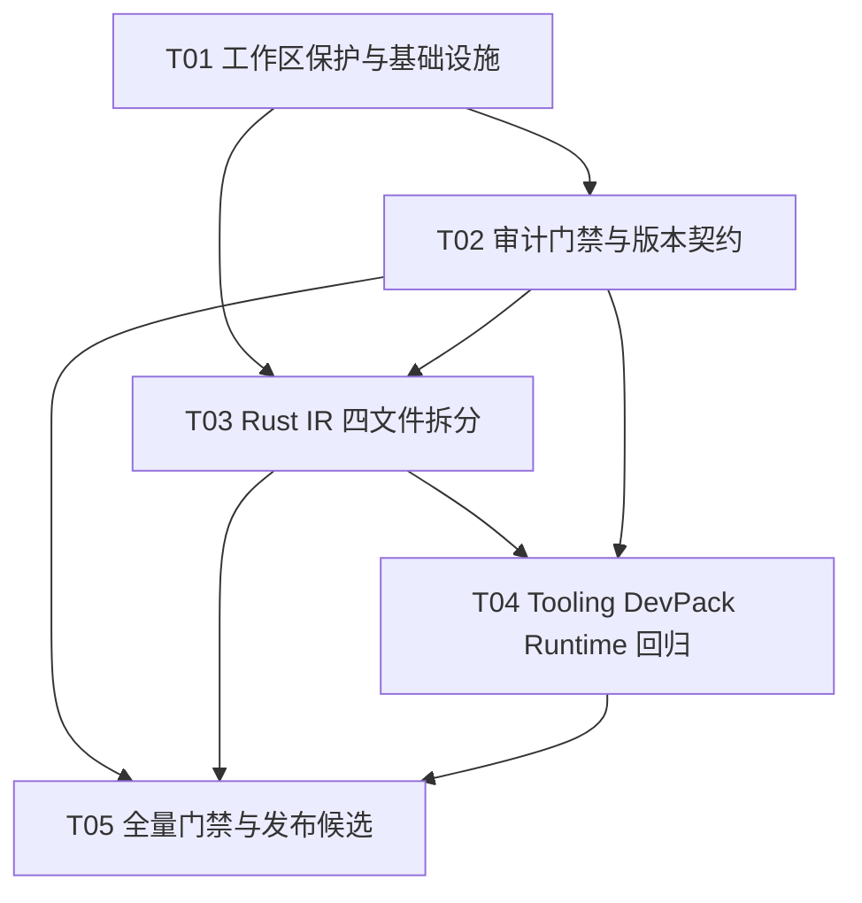

# Neo DevPack for Solidity v0.32 实施架构

> 文档类型：增量发布架构与实施计划（仅设计，不修改源码）  
> 基线：`D:\Git\neo-devpack-solidity`  
> 输入：`deliverables/v0.32-PRD.md`  
> 目标：在不丢失当前工作区 75 项未提交变更的前提下，完成 v0.32 的模块化、安全审计和发布门禁设计。

## 0. 基线与不可违反的约束

- 仓库约 510 个 Rust 文件、91,737 行；当前工作区存在 75 项未提交变更。v0.31 改动不得被覆盖、回退或重排。
- **禁止**建议或执行 `git stash`、`git reset`、`git clean`、强制 checkout/fetch 等可能损坏 refs 或覆盖工作区的操作。所有隔离、回滚和比较均采用文件级备份、只读 diff、补丁文件或独立临时目录。
- 生产 Rust 代码的 `panic!/unwrap()` 语义纠偏目标为 0；仍有约 26 个生产 `expect()`，必须逐项审查，不能以“已有 expect”自动豁免。
- 当前重点超长生产文件（以扫描结果为准）：
  - `src/ir/ir_expressions/dispatch/binary_u256_softarith.rs`（963 行）
  - `src/ir/ir_expressions/arrays.rs`（918 行）
  - `src/ir/ir_expressions/calls/member_calls.rs`（894 行）
  - `src/ir/ir_statements/dispatch/return_lower.rs`（866 行）
- `CHANGELOG.md` 误引了不存在/不适用的 `scripts/ci/*.py` 路径；Cargo package 仍为 `0.30.3`；缺少 v0.31 条目；`tests/audit_v031_followups.rs` 含 31 项回归测试，必须保留并纳入门禁。
- `src/Neo.Sol.Runtime` 是独立实验性 C# EVM 模拟库；不得在本版本架构中把它当成 `neo-solc` 的 NeoVM runtime，也不得将两者的版本、产物或回归结果混写。

### 0.1 工作区保护协议（实施前必须完成）

1. 仅使用只读命令记录基线：`git status --short`、`git diff --stat`、`git diff --name-only`、`git diff --check`；输出存到 `deliverables/v0.32-baseline/`，不触碰 index/refs。
2. 将 75 个已修改/未跟踪文件按原相对路径复制到仓库外的时间戳目录（例如 `D:\backups\neo-devpack-v032\preexisting\`），并生成 SHA-256 清单；备份目录不能位于仓库内。
3. 针对每一批重构，先把拟修改文件和备份文件做逐文件 diff；新模块先写入临时目录，完成编译检查后再原子替换同一批文件。不得删除原文件后再“凭记忆”恢复。
4. 每个阶段结束保存 `git diff --binary -- <files>` 到阶段补丁目录，并由 QA 比较“阶段起点 diff + 本阶段 diff”，确认 75 项变更仍存在。
5. 回滚时只恢复本阶段涉及的文件：先从备份复制，再用只读 `git diff` 审核；不得恢复整个仓库，不得触碰其他未提交文件。

## 1. 总体架构与实施原则

### 1.1 分层边界

```text
Solidity source
   -> frontend/parser/analysis (only produces typed frontend model)
   -> IR lowering (expressions/statements, no CLI/tooling dependency)
   -> optimizer
   -> codegen/NEF
   -> manifest + diagnostics (boundary-owned output)
   -> neo-solc CLI / Standard JSON

TypeScript tooling (neo-forge, Hardhat adapter)
   -> invokes stable neo-solc CLI/Standard JSON
   -> collects NEF/manifest artifacts and emits structured diagnostics

Embedded Rust NeoVM runtime -- test oracle and conformance harness
C# Neo.Sol.Runtime       -- independent experimental library/test project
```

单向依赖是硬约束：lowering 不依赖 CLI；manifest 不反向依赖 standard-json；TypeScript 不复制 Rust 版本/ABI 规则；C# 不参与 Rust compiler build。

### 1.2 选择与约束

- **Rust 2021 + Cargo**：已有编译器、IR、NEF、manifest 和 runtime，重构只移动职责，不更换框架；公共 `compile_contracts`、Standard JSON 和 CLI 保持兼容。
- **TypeScript + Node workspace**：沿用 `tooling/packages` 现有包和测试框架，按 `neo-foundry` build/artifact/error 边界拆分，避免引入新运行时。
- **Solidity DevPack**：保留 `.sol` wrapper/native/syscall API；只做接口兼容审查和产物回归，不以重写合约为 v0.32 目标。
- **C#/.NET**：只在独立 `Neo.Sol.Runtime.Tests` 中验证实验库；必须用单独 job/报告标识。
- **脚本**：优先 POSIX shell + Python 标准库（扫描/JSON/TOML-like白名单），脚本需可重复、无网络副作用；不把审计作为 informational `continue-on-error`。

### 1.3 稳定 API 契约

- Rust compile API：`compile_contracts(...)`、`compile_contracts_with_options(...)`、`compiler_version_string_4() -> String` 及其现有参数/返回类型不变。
- CLI：`neo-solc` 单文件和 Standard JSON 的退出码、诊断 code/severity/location、NEF 魔数、manifest schema 不变。
- Tooling：`NeoForge.build(options) -> Promise<BuildResult>`、Hardhat compiler adapter 的 artifact shape 不破坏；无 Solidity 输入必须非零退出。
- 内部新模块以 `pub(crate)` 函数转发，原调用点通过 `mod.rs`/`pub(crate) use` 兼容，不在拆分同时改语义。

## 2. 分阶段实施方案

### Phase 0 — 保护基线、勘测与接口冻结（P0，串行起点）

**目的**：在任何源码改动前建立可回滚证据，并识别当前 v0.31 变更的文件归属。

**涉及文件/目录**：

- `deliverables/v0.32-PRD.md`
- `Cargo.toml`、`Cargo.lock`
- `.github/workflows/ci.yml`、`.github/workflows/security.yml`
- `scripts/audit_file_length.sh`、`scripts/audit_unwrap.sh`、`scripts/unwrap-baseline.txt`
- `CHANGELOG.md`、`tests/audit_v031_followups.rs`
- 四个超长文件及其同目录 `mod.rs`
- 工作区中由只读 `git diff --name-only` 发现的全部 75 个路径（不要手工假定）

**动作与接口**：

- 记录文件快照、SHA-256、行数和当前审计结果；不写 `.git/index`。
- 从四个超长文件建立函数/类型清单，确认自然边界；先测试再移动。
- 冻结公共符号清单：`emit_u256_*`、`lower_*_array_*`、`try_lower_member_call`、`inline_library_storage_call`、`lower_return_statement`、`lower_implicit_return` 等的签名和可见性。

**依赖/并行边界**：

- 必须先于全部阶段。
- 快照、行数勘测、expect 清单可并行；任何重构不可与基线复制并行。
- QA 需确认工作区保护证据后才允许开始 Phase 1/2。

**退出条件**：75 项工作区变更均可在备份中逐文件定位；四个文件的自然边界和测试映射评审通过；无 stash/reset/clean 操作。

### Phase 1 — 审计脚本、CI 门禁与版本元数据（P0）

**目的**：先建立不会被后续拆分绕过的生产代码安全门禁和单一版本来源。

**涉及文件**：

- `scripts/audit_file_length.sh`（或保留入口并转调新实现）
- `scripts/audit_unwrap.sh`、`scripts/unwrap-baseline.txt`
- `scripts/expect-whitelist.toml`（新增）
- `scripts/check_version_consistency.py`（新增）
- `scripts/version_sync.sh`（新增/替代当前宽泛 `update_versions.sh`）
- `.github/workflows/ci.yml`、`.github/workflows/security.yml`
- `Cargo.toml`、`Cargo.lock`、`CHANGELOG.md`
- `src/cli/cli_parts/cli_defs.rs`、`src/manifest/build.rs`
- `package.json`、`tooling/package.json`、`tooling/packages/*/package.json`（仅版本同步需要的包）

**改动接口/签名**：

- `audit_file_length.sh`：`FILE_LENGTH_LIMIT` 默认 800；扫描一方生产 Rust（排除 `target/`、测试 fixture/生成物），返回码 0=通过、1=超限、2=配置/扫描错误；豁免必须是显式路径清单且具备理由。
- `audit_unwrap.sh`：`UNWRAP_BASELINE_FILE` 可配置；扫描生产区和测试区两份报告；生产 `panic!`/`.unwrap()` 为硬失败；`expect()` 仅接受带稳定 invariant 注释且在 `expect-whitelist.toml` 登记的实例。返回码 0=通过、1=违规、2=脚本配置错误、3=IO/解析错误。
- `check_version_consistency.py`：读取 `Cargo.toml [package].version` 作为发布版本；校验 `env!("CARGO_PKG_VERSION")` 派生的 CLI/manifest 逻辑、选定 TS package 版本和 changelog heading，不直接修改文件。
- `version_sync.sh <version>`：显式参数才允许同步 TS package；拒绝无参数/正则批量替换；Cargo 版本由发布者按现有 package 流程更新。`src/manifest/build.rs` 继续调用 `compiler_version_string_4()`，不复制硬编码版本。

**expect 策略**：

- 生产扫描根为 `src/**/*.rs`，排除 `src/**/tests/**`、`#[cfg(test)]` 模块代码和生成目录；测试代码单独统计，不作为生产 allowlist。
- 每个生产 expect 必须有相邻 `// INVARIANT:`（说明数据来源、边界和为何不可能失败），并在 TOML 记录 `path`、函数/表达式指纹、理由、owner、审核日期、过期日期；按指纹而非行号校验，防止拆分后行号漂移。
- 白名单只允许不可由用户输入影响的常量表/已检查范围/编译期正则等；不允许用 `#[allow]`、整文件豁免或“旧代码”理由绕过。
- 更新 expect 先改测试和白名单审计记录，再改实现；超期条目硬失败。

**CI 接线**：

- PR `core` job 顺序：保护检查（只读）→ fmt → check → clippy `-D warnings` → 生产审计（硬门禁）→ unit/integration tests → release build。
- `security.yml` 复用脚本并上传 `build/audit/*.json`；不得使用 `continue-on-error: true`。
- `ci.yml` 的 Neo-Express smoke 与 audit job 通过 `needs` 串接；审计失败阻塞 smoke/release。
- nightly fuzz/performance 可独立运行，但不得替代 PR 的生产审计。

**并行边界**：版本检查、文件长度扫描、expect 审核可并行；workflow 修改需在脚本接口冻结后进行。

**退出条件**：脚本错误码可由 CI 识别；误引的 `scripts/ci/*.py` 全部改为真实路径；v0.31 changelog 条目和 v0.32 草稿结构准备好；Cargo manifest 生成逻辑未被改写。

### Phase 2 — Rust IR 四文件领域拆分（P0，最小语义变更）

**目的**：将自然职责移入聚合模块，保持 `pub(crate)` API、scratch local 约定、指令顺序和产物字节不变。禁止按行数机械切割单一 match 链。

**涉及文件**：见第 3 节的完整拆分设计，以及同目录 `mod.rs`、相关 IR 单元/回归测试。

**接口策略**：

- 原文件保留为 dispatcher/facade，使用 `mod` 和 `pub(crate) use` 重新导出；调用方不改路径。
- 每次只移动一个自然域，移动后运行 `cargo fmt --check`、`cargo check --all-targets --all-features` 和该域测试。
- 先移动纯 helper，再移动依赖 helper 的 emitter，最后移动顶层 dispatch；不会在一次提交同时改变算法、命名或错误语义。

**并行边界**：

- 四个文件彼此可由不同工程师并行，但同一文件内必须串行（每个边界先编译）。
- `binary_u256_softarith` 与 `return_lower` 都使用 `LoweringContext`，但不共享可变 scratch；需在集成阶段验证 label/local 不冲突。
- Phase 2 可与 Phase 3（TypeScript/DevPack 回归用例设计）并行，但不能与版本/审计脚本的路径重命名并行。

**退出条件**：四个 facade 均 ≤800 行或有明确结构性豁免；所有旧调用路径编译；代表性合约 NEF 和 manifest 差异为零或有批准记录；`tests/audit_v031_followups.rs` 的 31 项全部通过。

### Phase 3 — tooling、DevPack、runtime 与跨包回归（P1/P0）

**目的**：验证拆分没有破坏构建产品、标准合约、嵌入 runtime 及独立 C# 实验库边界。

**涉及文件/目录**：

- `tooling/packages/neo-foundry/src/{forge,config,compiler-invoker,build-cache,artifact-collector,build-error}.ts`
- `tooling/packages/neo-foundry/test/forge-build.test.ts`
- `tooling/packages/hardhat-solc-neo/src/{compiler,artifacts,index}.ts` 及对应 tests
- `tooling/packages/integration-tests/{src,test}`
- `devpack/contracts/Framework.sol`、`FrameworkBase.sol`、`NativeCalls.sol`、`NativeContracts.sol`、`Syscalls.sol` 及标准/兼容合约测试 fixture
- `src/runtime/**` conformance/gas tests（仅 P1 范围）
- `src/Neo.Sol.Runtime/**`、`tests/Neo.Sol.Runtime.Tests/**`（独立 job）
- `tests/audit_v031_followups.rs`、`tests/fuzz_tests/**`、`examples/test_neoxp_*.sh`

**改动接口/签名**：

- `NeoForge.build(options)` 成功返回现有 artifact shape（NEF、manifest、路径、cache hit）；失败抛出/返回含 `code`, `severity`, `file`, `line`, `column`, `message` 的稳定诊断。
- `CompilerInvoker.invokeStandardJson(input, options)` 保留编译器调用参数、stderr/stdout 分离和非零退出语义。
- `BuildCache.get/put(key, artifacts)` 保证 profile/source/options 变化时失效；空输入返回非零且可操作诊断。
- runtime conformance 向量区分 exact/approximate/unsupported gas；异常嵌套、rethrow、TRY/CATCH/FINALLY 不得静默吞错。
- C# `Neo.Sol.Runtime` 只验证自己的 `EvmRuntime`/`ExecutionContext` API，不作为 Rust compiler 的 acceptance gate。

**并行边界**：neo-foundry、Hardhat adapter、DevPack fixture、Rust runtime conformance、C# tests 可并行；最终 artifact/manifest 集成必须串行。

**退出条件**：scaffold→`neo-forge build`→NEF/manifest→解析/缓存→失败诊断全链路通过；标准合约 ABI/权限/标准检测不变；Rust runtime 与 Neo-Express 差异有记录；C# 报告单独归档。

### Phase 4 — 发布候选、全量验证与交付（P0）

**目的**：按第 5 节顺序执行全量门禁，形成可审核的 release candidate，不在此阶段引入新功能。

**涉及文件**：`.github/workflows/{ci,security,fuzz,release}.yml`、`CHANGELOG.md`、`README.md`/限制文档、`docs/**`、`deliverables/v0.32-*` 以及所有阶段改动文件。

**退出条件**：所有门禁通过；Cargo 版本与生成 manifest/CLI/TS 包一致；变更记录明确 v0.31/v0.32；工作区保护核对通过；release 只在人工批准后进行。

## 3. 四个超长生产文件的安全拆分设计

### 3.1 `binary_u256_softarith.rs`（当前 963 行）

**自然边界**（按算法和 scratch 生命周期切分，而不是按行）：

| 新文件 | 职责 | 主要接口 |
|---|---|---|
| `src/ir/ir_expressions/dispatch/u256_primitives.rs` | literal/op/mask、unsigned compare、limb combine | `u256_push(&mut Vec<Instruction>, BigInt)`；`u256_bop(&mut Vec<Instruction>, BinaryOperator)`；`u256_mask128() -> BigInt`；`u256_bias127() -> BigInt`；`u256_mask64() -> BigInt`；`emit_u256_unsigned_compare(&mut Vec<Instruction>, BinaryOperator)`；`emit_u256_combine_limbs(...)` |
| `.../u256_limb_ops.rs` | 128/64-bit limb add/sub/mul，scratch pool 约定 | `emit_u256_limb_op(BinaryOperator, &mut LoweringContext, &mut Vec<Instruction>)`；`emit_u256_unchecked_add_ir(...)`；`emit_u256_unchecked_sub_ir(...)`；`emit_u256_mul_columns_ir(...) -> Vec<usize>`；`emit_u256_mul_build_result_ir(...)`；`emit_u256_unchecked_mul_ir(...)` |
| `.../u256_shifts.rs` | logical unsigned shift、signed shift、left wrap | `emit_u256_logical_shr_ir(&mut LoweringContext, &mut Vec<Instruction>)`；`emit_u256_shl_ir(...)`；`emit_i256_arith_shr_ir(...)` |
| `.../u256_divmod.rs` | unsigned div/mod 和内部 build helper | `emit_u256_divmod_ir(&mut LoweringContext, &mut Vec<Instruction>, bool)`；私有 `emit_u256_build_256_ir(...)` |
| `.../u256_modular.rs` | 512-bit mulmod、addmod | `emit_u256_mulmod_512bit_ir(...)`；`emit_u256_addmod_ir(..., a_slot: usize, b_slot: usize, m_slot: usize)` |
| 原 `binary_u256_softarith.rs` | facade + checked arithmetic/顶层 dispatch | `emit_u256_checked_arith(...)` 及其余对外入口；`mod` 声明并 `pub(crate) use` 上述函数 |

**关键不变量**：保留 `u256_scratch_locals` 的槽位分区（特别是 mulmod 的 `s[3..10]` 持久区与 `s[0..3]` 临时区）；不把 scratch 状态包装成会改变分配顺序的新对象；所有 `JumpIf` 的“条件为 false 时跳转”语义原样保留；checked add/sub/mul 的 0x11 panic 不变。每移动一个域，使用现有 U256/IR 测试和代表性 `uint256`/`mulmod`/shift fixture 对比 NEF 字节码。

### 3.2 `arrays.rs`（当前 918 行）

| 新文件 | 职责 | 主要接口 |
|---|---|---|
| `src/ir/ir_expressions/array_bounds.rs` | array operand、storage bounds、struct field bounds、clamp | `lower_indexable_array_operand(...) -> bool`；`mapping_terminal_hits_array(...) -> Option<StorageArrayBound>`；`emit_storage_array_subscript_with_bounds(...) -> bool`；`emit_struct_field_array_bounds_guard(...) -> bool`；`clamp_local(...)` |
| `.../array_slices.rs` | Array/bytes slice 两条语义路径 | `lower_array_slice_expression(...) -> bool`；`is_bytes_slice_target(...) -> bool`；`lower_bytes_slice_expression(...) -> bool` |
| `.../array_literals.rs` | array literal 分配和元素填充 | `lower_array_literal_expression(&[Expression], &mut LoweringContext, &mut Vec<Instruction>) -> bool` |
| 原 `arrays.rs` | facade 与 `lower_array_subscript_expression` dispatcher | 保留 `lower_array_subscript_expression(...) -> bool`，通过 `pub(crate) use` 连接 helper |

**关键不变量**：memory/storage array 越界均为 Panic(0x32)；fixed-size array 不读取虚构 length slot；bytes slice 使用 SUBSTR 并返回 ByteArray；array slice 保持 NewArray/ArrayGet 语义；不要把 mapping resolution 与 bounds guard 拆成两次表达式求值导致副作用变化，现有“双评估折衷”必须以测试和注释显式保留。

### 3.3 `member_calls.rs`（当前 894 行）

当前 `try_lower_member_call` 内嵌了多个解析 helper，拆分时先把 helper 提升为模块级 `pub(crate)`/私有函数，再移动分支，避免闭包捕获上下文隐式变化。

| 新文件 | 职责 | 主要接口 |
|---|---|---|
| `src/ir/ir_expressions/calls/member_resolution.rs` | 静态 library/contract/native constant 解析、builtin member 格式化 | `format_builtin_member_list(&[&str]) -> String`；`resolve_static_library_base(...) -> Option<String>`；`resolve_contract_type_name(...) -> Option<String>`；`native_contract_from_constant(...) -> Option<NativeContract>` |
| `.../member_external.rs` | `System.Contract.Call`、native calls、低级 EVM 诊断、iterator syscalls | 新增 `lower_external_member_call(...) -> Option<bool>`，参数显式传入 `func/inner/member/args/ctx/instructions` |
| `.../member_library.rs` | using-for、命名 library、builtin library、不支持 member 诊断 | 新增 `lower_library_member_call(...) -> Option<bool>`，显式接收 `receiver_type`/`arg_count` |
| `.../member_storage_inline.rs` | `T storage` receiver inline 和 return redirect | `inline_library_storage_call(LibraryStorageBody, StorageReference, &[Expression], &mut LoweringContext, &mut Vec<Instruction>) -> bool` |
| 原 `member_calls.rs` | 顺序 dispatcher（super、value type、external、library、iterator、error） | `try_lower_member_call(...) -> Option<bool>` 保持原签名和优先级 |

**关键不变量**：external target 与 merged static library 的判定优先级不变；`this`/`super` 不误判为 internal library；Neo syscall stack order `[args, flags, method, hash]` 不变；void function 返回 `Some(false)` 防止 spurious Drop；未知 member 必须 fail loud，不恢复旧的“drop args + push 0”静默兼容。

### 3.4 `return_lower.rs`（当前 866 行）

| 新文件 | 职责 | 主要接口 |
|---|---|---|
| `src/ir/ir_statements/returns/return_dispatch.rs` | explicit/implicit/top-level return、inline/modifier target | `lower_return_statement(...) -> bool`；`lower_implicit_return(...) -> bool` |
| `.../return_abi.rs` | ABI passthrough、static/dynamic slots、array wrapper | `wrap_external_single_array_return_value(...) -> bool`；`lower_abi_decode_passthrough_return(...) -> bool`；已有 ABI slot helper 的 `pub(crate)` 转发 |
| `.../return_tuples.rs` | abi.decode matcher、nested tuple flatten | `extract_abi_decode_call(...) -> Option<Vec<Expression>>`；`abi_decode_types_match_return_arity(...) -> bool`；`abi_decode_types_match_return_arity_mixed(...) -> bool`；`flatten_tuple_return_params(...) -> bool` |
| 原 `return_lower.rs` | facade/re-export，仅保留最小 dispatch glue | 对外入口签名全部不变 |

**关键不变量**：inline library return 只跳到 inline end label，不 RET caller；catch frame return 先 ENDTRY；external multi-return 继续 canonical ABI bytes，internal multi-return 继续 Array；静态/混合 `abi.decode` passthrough 的 Panic(0x41) guard 不变；fixed nested array leaf 上限 65,536 不变；return slot 为空时诊断而非 panic。

## 4. 审计脚本与 CI 门禁详细设计

### 4.1 生产/测试代码区分

| 区域 | 规则 | 报告 |
|---|---|---|
| Rust production | `src/**/*.rs`，排除 `tests`、fixture、`target`；C# 单独处理 | `build/audit/production.json`，违规硬失败 |
| Rust tests | `tests/**/*.rs`、`src/**/tests*.rs` | `build/audit/tests.json`，允许测试 fixture 的 `expect`，但仍报告新增 panic |
| TypeScript production | `tooling/packages/*/src/**/*.ts` | `build/audit/typescript.json`，由 package lint/test 约束 |
| Solidity DevPack | `devpack/contracts/**/*.sol` | 编译、ABI/manifest/NEP 标准回归，不做 Rust unwrap 扫描 |
| C# experimental | `src/Neo.Sol.Runtime/**/*.cs` | `dotnet test tests/Neo.Sol.Runtime.Tests` 独立报告和 job |

### 4.2 文件长度审计

保留 `scripts/audit_file_length.sh` 作为稳定入口，修复其仅扫描 `src/`、无生产/测试分类和 CI informational 的问题。实现输出机器可解析 JSON 与人类摘要；默认阈值 800；大文件豁免只允许生成物/专门测试，并需 `path/reason/owner/expires` 清单。超过阈值返回 1，脚本异常返回 2。Rust、TS、Solidity 三种扫描可由参数选择，但发布门禁至少阻塞 Rust production。

### 4.3 panic/unwrap/expect 审计

- 扫描 token/AST 而非简单 grep，避免把注释和字符串误报；若工具实现复杂，grep 只作初筛，Rust parser/行上下文作最终判定。
- production `panic!`、`todo!`、`unimplemented!`、`.unwrap()` 均为 0；现有生产 `expect()` 逐一迁移为 checked path 或登记白名单。
- 白名单结构示例：`path`、`symbol_fingerprint`、`kind`、`invariant`、`owner`、`reviewed_at`、`expires_at`。行号仅作提示，不作身份。
- 每项 expect 附近须有 `// INVARIANT:` 说明；缺注释即失败。测试代码可保留 `expect`，但必须报告总量和新增量，防止测试掩盖产品代码。
- 基线采用数量+指纹，不接受仅更新 `unwrap-baseline.txt` 来吞掉回归。

### 4.4 GitHub workflow 接线

- `ci.yml/core`：checkout → toolchain → fmt → check → clippy → `audit_file_length.sh` → `audit_unwrap.sh` → Rust tests → release/lean build。
- `security.yml`：只读审计、依赖/CodeQL 和白名单过期检查；上传 JSON artifact；任何审计脚本非 0 均阻塞。
- `ci.yml/neoxp-smoke`：`needs: [core, security]`，只在门禁通过后运行；保留 core/calls/storage/misc matrix。
- `fuzz.yml`：nightly 深度 fuzz、property/conformance；PR 至少运行固定 smoke 和 31 项 `audit_v031_followups`。
- `release.yml`：必须依赖 core、security、Neo-Express smoke、TS integration、C# 独立测试结果，并要求人工批准；不在发布 job 中自动修复版本或修改白名单。

## 5. 版本元数据单一来源

1. **权威源**：根 `Cargo.toml [package].version`。当前仍是 `0.30.3`，不能在架构阶段擅自改成 0.32；实施发布任务才在批准后改为目标版本。
2. Rust CLI 使用既有 `env!("CARGO_PKG_VERSION")`（`src/cli/cli_parts/cli_defs.rs`/single-file CLI）；保持 `COMPILER_ID`、`VERSION_STR` 和 `compiler_version_string_4()` 的派生方式。
3. `src/manifest/build.rs` 继续调用 `compiler_version_string_4()` 生成 manifest `features.Version`/对应版本字段，不硬编码，不另建版本常量。
4. TypeScript package version 属于发布镜像：`scripts/check_version_consistency.py` 读取 Cargo 版本校验；`scripts/version_sync.sh <version>` 仅对明确 package 列表执行同步，禁止当前 `update_versions.sh` 的多版本 `sed` 猜测替换。各 package 的协议字段（Solidity version、Neo protocol version、transaction version）不是产品版本，不参与替换。
5. `Cargo.lock` 由 Cargo 在有权限的实施阶段按既有流程更新；不能手改生成内容。生成 manifest/NEF 测试必须断言版本来自 Cargo env。
6. `CHANGELOG.md` 需补 v0.31（真实已落地改动）再新增 v0.32 Unreleased/Release；所有脚本路径改成仓库实际路径，不能再引用不存在的 `scripts/ci/*.py`。

## 6. 测试矩阵与执行顺序

> 命令可能写入 `target/`、测试临时目录、覆盖率/缓存，部分 Git 审核命令会读取 `.git`。后续实施/QA 必须在具备明确写权限的环境执行；架构阶段不执行这些命令，不建议修改 refs。

| 顺序 | 门禁 | 命令/动作 | 目的 |
|---:|---|---|---|
| 0 | 工作区保护 | 只读 status/diff/name-only；外部文件备份与 SHA 清单 | 确认 75 项 v0.31 变更未丢 |
| 1 | 格式 | `cargo fmt --all -- --check`；TS formatter/lint check | 防止移动模块产生格式噪声 |
| 2 | 编译 | `cargo check --workspace --all-targets --all-features`；`cargo build --release`；`cargo build --no-default-features --bin neo-solc` | compiler/runtime/full+lean 边界 |
| 3 | lint/audit | `cargo clippy --workspace --all-targets --all-features -- -D warnings`；生产长度、panic/unwrap/expect、版本一致性脚本 | 质量门禁与版本契约 |
| 4 | Rust tests | `cargo test --workspace --all-features`；显式 `cargo test --test audit_v031_followups`；`cargo test --test fuzz_tests`（固定 smoke） | 31 项回归、单元、集成、property |
| 5 | docs | `cargo doc --workspace --no-deps`；文档结构/链接检查 | API/限制说明无破损 |
| 6 | TS | 在 `tooling/` 使用锁定的 package manager 执行 build/typecheck/test；重点 `neo-foundry`、Hardhat adapter、integration-tests | artifact/cache/诊断跨包契约 |
| 7 | Solidity/NEF | 编译 DevPack 标准合约和代表性 ERC/NEP fixtures；比较 NEF 脚本、manifest ABI/permissions/standards | 产物兼容 |
| 8 | Neo-Express | `.github/workflows/ci.yml` 的 core/calls/storage/misc smoke | 真实 Neo N3 VM oracle |
| 9 | C# | `dotnet test tests/Neo.Sol.Runtime.Tests`（独立 job，按 .NET 目标框架） | 独立实验库，不混入 Rust runtime 结论 |
| 10 | 发布候选 | release workflow dry-run、changelog/version/限制审查、外部备份 diff 审查 | 人工批准前的完整证据包 |

失败处理：fmt/check 阶段失败先修导入/模块边界；NEF/manifest 字节差异必须定位到具体 fixture 并获批准；Neo-Express 与 simulator 差异必须归档为规范差异或回滚拆分，不得改测试掩盖。

## 7. 有序任务列表（不超过 5 项）

### T01 — 项目基础设施与工作区保护（P0）

- **涉及文件**：`Cargo.toml`、`Cargo.lock`、`.github/workflows/ci.yml`、`.github/workflows/security.yml`、`scripts/audit_file_length.sh`、`scripts/audit_unwrap.sh`、`scripts/unwrap-baseline.txt`、`CHANGELOG.md`、`tests/audit_v031_followups.rs`、`deliverables/v0.32-baseline/*`。
- **依赖**：无。
- **验收条件**：记录 75 项变更及外部 SHA 备份；无 stash/reset/clean；现有脚本和 workflow 的真实路径清单完成；31 项回归未被移除；基线报告可复核。
- **并行边界**：快照与静态勘测可并行；其他任务必须等待保护协议签字。

### T02 — 审计门禁与版本元数据契约（P0）

- **涉及文件**：`scripts/audit_file_length.sh`、`scripts/audit_unwrap.sh`、`scripts/expect-whitelist.toml`、`scripts/check_version_consistency.py`、`scripts/version_sync.sh`、`Cargo.toml`、`Cargo.lock`、`src/cli/cli_parts/cli_defs.rs`、`src/manifest/build.rs`、`.github/workflows/ci.yml`、`.github/workflows/security.yml`、`CHANGELOG.md`。
- **依赖**：T01。
- **验收条件**：production/test 分离扫描；生产 panic/unwrap 为 0；26 个 expect 全部有 invariant/白名单审查结果；脚本错误码 0/1/2/3 稳定；CI 不再 `continue-on-error`；版本检查以 Cargo 为源且不破坏 manifest 生成。
- **并行边界**：长度、expect、版本脚本开发可并行；workflow 接线依赖三者接口冻结。

### T03 — Rust IR 四大模块安全拆分（P0）

- **涉及文件**：四个原文件及新模块：`src/ir/ir_expressions/dispatch/{binary_u256_softarith,u256_primitives,u256_limb_ops,u256_shifts,u256_divmod,u256_modular}.rs`；`src/ir/ir_expressions/{arrays,array_bounds,array_slices,array_literals}.rs`；`src/ir/ir_expressions/calls/{member_calls,member_resolution,member_external,member_library,member_storage_inline}.rs`；`src/ir/ir_statements/{dispatch/return_lower,returns/return_dispatch,returns/return_abi,returns/return_tuples}.rs`；对应 `mod.rs` 和 IR/CLI regression tests。
- **依赖**：T01、T02。
- **验收条件**：自然边界拆分，facade re-export 后旧调用签名不变；单文件 ≤800 行或有审计豁免；U256 scratch、JumpIf、panic codes、ABI/return、external call stack order 与拆分前一致；Rust 全量及 31 项回归通过。
- **并行边界**：四个文件可并行；每个文件内部按 helper→emitter→dispatcher 串行。

### T04 — Tooling、DevPack 与 runtime 跨包回归（P1/P0）

- **涉及文件**：`tooling/packages/neo-foundry/src/{forge,config,compiler-invoker,build-cache,artifact-collector,build-error}.ts`、对应 tests；`tooling/packages/hardhat-solc-neo/src/{compiler,artifacts,index}.ts`、tests；`tooling/packages/integration-tests/**`；`devpack/contracts/{Framework,FrameworkBase,NativeCalls,NativeContracts,Syscalls}.sol` 及 fixtures；`src/runtime/**` conformance/gas tests；`src/Neo.Sol.Runtime/**`、`tests/Neo.Sol.Runtime.Tests/**`。
- **依赖**：T03（tooling/runtime fixture 设计可提前，但集成验收依赖 T03）。
- **验收条件**：`neo-forge build` 成功/失败/空输入/缓存/版本诊断契约通过；Hardhat artifact 解析通过；DevPack manifest/ABI/permissions/standards 不变；runtime P1 异常/gas 测试通过并标注 exact/approximate/unsupported；C# 独立测试通过且不被误算 Rust gate。
- **并行边界**：neo-foundry、Hardhat、DevPack、Rust runtime、C# 可并行；跨包 artifact 集成串行。

### T05 — 全量质量门禁、发布候选与回滚演练（P0）

- **涉及文件**：`.github/workflows/{ci,security,fuzz,release}.yml`、`CHANGELOG.md`、`README.md`、`docs/**` 限制/版本文档、所有 T01–T04 改动文件、外部备份/阶段补丁。
- **依赖**：T02、T03、T04。
- **验收条件**：按第 6 节顺序完成 fmt/check/clippy/audit/test/doc/TS/Solidity/Neo-Express/C#；release workflow 仅依赖通过的 gate 并有人审；v0.31/v0.32 changelog 与脚本路径正确；演练文件级回滚不影响其他 75 项变更；输出完整 evidence bundle。
- **并行边界**：单项测试可按矩阵并行；最终 release candidate、版本核对和回滚审查必须串行。

## 8. Mermaid 依赖图

详见 `docs/sequence-diagram.mermaid` 与 `docs/class-diagram.mermaid`（交付目录同步副本：`deliverables/v0.32-sequence-diagram.mermaid`、`deliverables/v0.32-class-diagram.mermaid`）。任务依赖：



## 9. 风险与文件级回滚方案

| 风险 | 影响 | 预防/检测 | 回滚 |
|---|---|---|---|
| 误覆盖 75 项工作区变更 | 丢失 v0.31 修复 | Phase 0 外部备份、SHA、阶段 diff；禁止 stash/reset | 仅复制被本阶段触碰的备份文件；其余文件不动 |
| 机械拆分改变 IR 指令序列 | NEF/运行时行为变化 | 函数边界映射、NEF byte diff、Neo-Express smoke | 恢复对应原文件和 `mod.rs`，保留其他阶段文件；不全仓回退 |
| scratch local/label 冲突 | 编译产物或执行 fault | 保持槽位分区、单文件增量编译、U256 边界测试 | 恢复对应 U256 子模块及 facade，重新运行 diff |
| external/member 分支优先级改变 | 错误调用或 silent fallback | 分支覆盖矩阵、using-for/this/super/native/iterator fixtures | 仅回滚 member_calls 相关文件 |
| ABI return/manifest 版本漂移 | 下游客户端不兼容 | manifest/NEF golden、Cargo env 版本检查 | 恢复 return/manifest 文件，保留审计脚本 |
| 审计脚本误报或漏报 | CI 阻塞/安全回归 | fixture-driven script tests、错误码 2/3 区分 | 暂停 release，修脚本/白名单，不用 `continue-on-error` 绕过 |
| target/.git 权限不足 | 测试/快照无法完成 | 在 QA 开始前申请目录权限并声明写入范围 | 换有权限的 runner；不对 refs 做修复性写操作 |
| simulator 与真实 Neo N3 差异 | 线上 fault | Neo-Express differential/smoke | 回滚引入差异的文件，保留差异证据与规范链接 |
| C# 实验库边界被误合并 | 错误发布承诺 | 独立 workflow/project/test report | 从 Rust release gate 移除错误耦合，恢复独立测试路径 |

**回滚操作纪律**：每次回滚先停止后续 job，保存失败日志和当前 diff；仅按文件清单从外部备份恢复；执行 `git diff --check` 和测试；由 team-lead/QA 复核后再继续。绝不执行 `git stash`、`git reset`、`git clean` 或强制 ref 操作。

## 10. 尚待确认但不阻塞本架构

1. P0 文件长度门槛最终是所有一方生产代码 ≤800 行，还是 Rust `src/` 为硬门禁、TS/Solidity 仅报告；本方案先对 Rust 硬阻塞，其他语言按同一报告接口纳入发布评审。
2. Runtime parity 的唯一 Neo N3 规范/节点版本（PRD 建议 v3.10.0+）需由 QA 指定；在确认前测试向量标记来源和精度等级。
3. `neo-foundry` 配置兼容目标是独立 `neo-foundry.toml` 还是完整 `Foundry.toml`；本阶段只保证既有配置字段，不扩展未承诺的 Foundry 功能。
